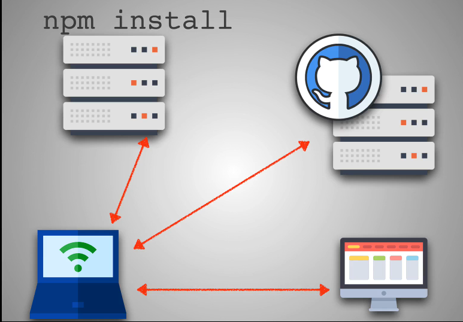

### SSH

## Definition

SSH or secure shell protocol
well http/https is a protocol to access a server
SSH is a protocol to access a computer
as we know shell is our tool to manipulate our computer(our OS)
so SSH is our tool to manipulate our computer remotely

## First command to know

ssh {user}@{host} => shh root@162.52.125.65

## Why using it

- To access github remotely
- To access a computer remotely
- To access a deployement server remotely

## How SSH works

So in this section, we'll talk about how we can do what we in SSH
Lets talk about the encryption techniques used in SSH

### Symmetrical Encryption

Use of same key to encrypt and decrypt message from host to client
Do you know Alice and Bob story ?
If yes, let me remind the story to you
"story"
algorithm used: key exchange algo

### Asymmetrical Encryption

Usage of pubic and private key
Here is another story about Alice and Bob
"story"
algorithm used: Deffie Hellman key exchange algo

### Hashing

Now that we know how can we exchange message
What if someone get in the middle of the conversation to steal data
Here Hashing come up
"how hashage works"

From now on we have a secure remote connection
